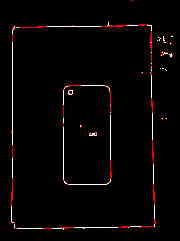
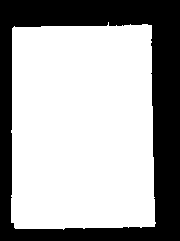
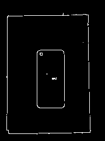
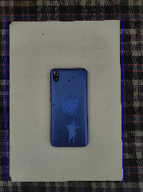
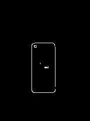
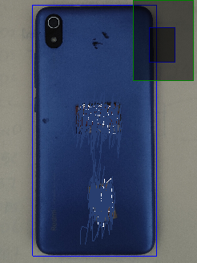
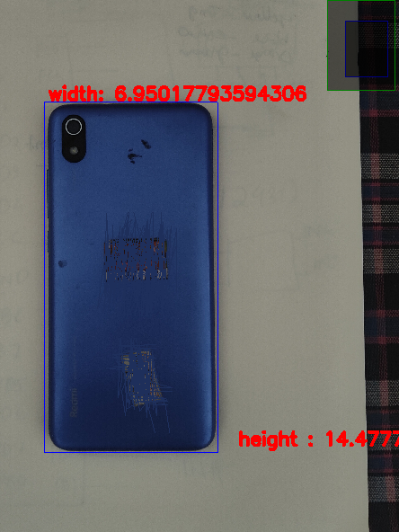

### python-BPMS -: 
    Boarder precision measurement System
    You need to adjust the code for the particular image properties... otherwise it wont give accurate data

Original Image 

Contour applied on detected edges

Erasing Mask 

After Erasing the outer Noise

Detected Papper

Erased Papper boarder:

Detected Object

Measured Dimension

